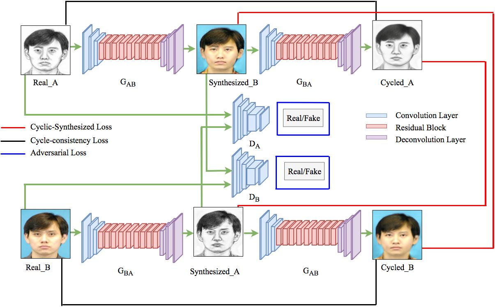

# CSGAN Implementation in PyTorch
This is the implementation of our paper called <b>"CSGAN:Cyclic-Synthesized Generative Adversarial Network For Image-to-Image Transformation."<b> <a href="https://arxiv.org/abs/1901.03554">https://arxiv.org/abs/1901.03554</a>.
## CSGAN Architectue

   

## Acknowledgments
- We gratefully acknowlege the NVIDIA Corp. for donating us the NVIDIA GeForce Titan X Pascal GPU used for this research.

- code is heavily borrowed from CycleGAN Paper [pytorch-CycleGAN](https://github.com/junyanz/pytorch-CycleGAN-and-pix2pix).
